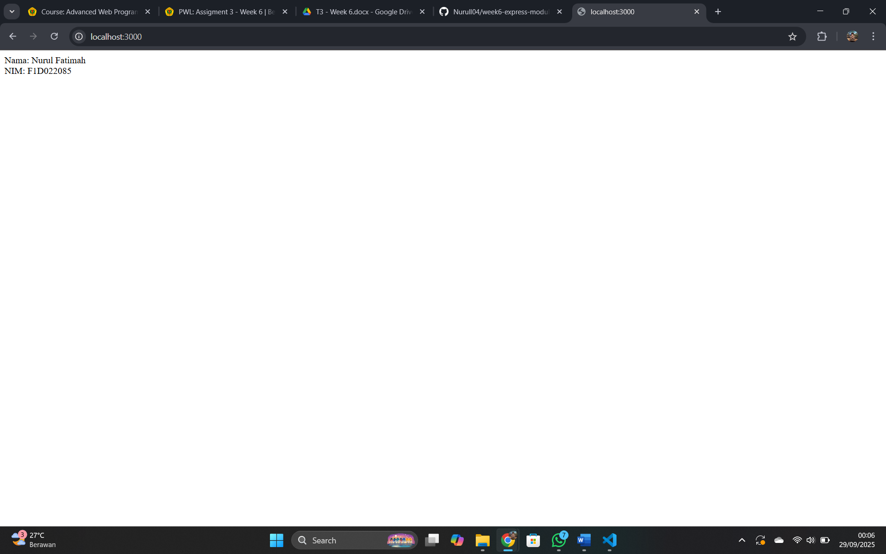
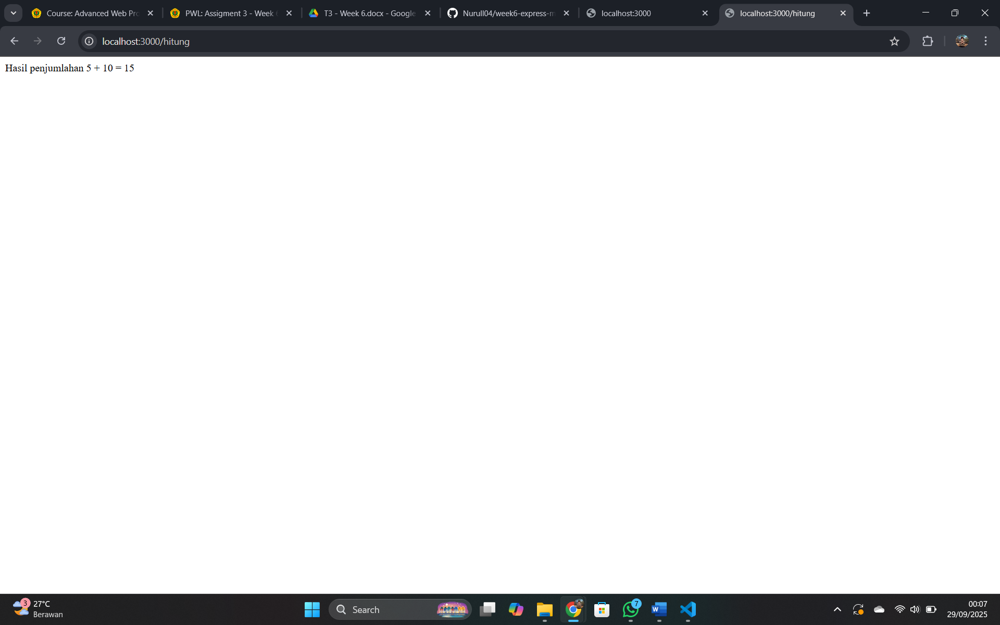
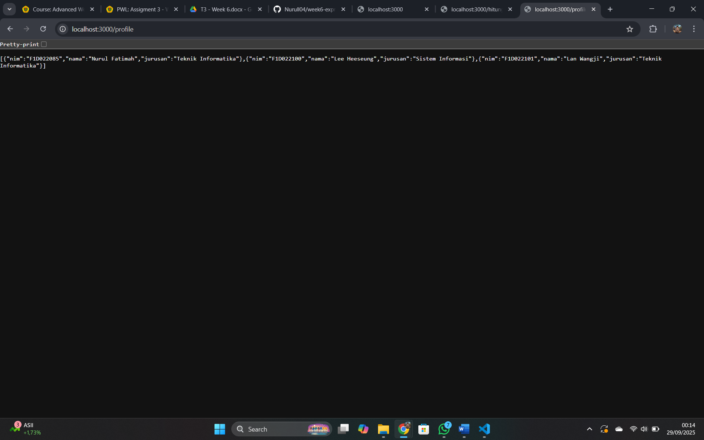
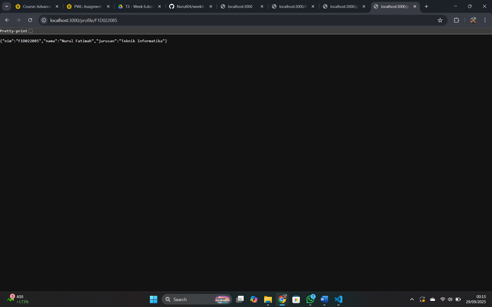

# Assignment: Express.js & Modul Node.js

## Identitas
- Nama : Nurul Fatimah
- NIM  : F1D022085

---

## Deskripsi Tugas
Tugas ini untuk mempraktikkan penggunaan dasar Express.js dan pemanggilan modul lokal pada Node.js.
Melalui project ini, server sederhana dikembangkan dengan beberapa route, seperti route utama untuk menampilkan identitas, route yang memanfaatkan fungsi dari modul math.js, serta route modular yang menampilkan data profil.

### Fitur:
1. Route `/` → Menampilkan Nama dan NIM.
2. Route `/hitung` → Menampilkan hasil penjumlahan dari fungsi `tambah()` di `math.js`.
3. Route `/profile` → Menampilkan daftar profil (array JSON).
4. Route `/profile/:nim` → Menampilkan detail profil berdasarkan NIM.

---

## Hasil
### 1. Route NIM dan Nama
**URL:** `http://localhost:3000/`  
**Output:**
  

### 2. Route Hitung
**URL:** `http://localhost:3000/hitung`  
**Output:**  
  

### 3. Route Profile
**URL:** `http://localhost:3000/profile`  
**Output (contoh JSON):**

### 4. Route Detail Profile
**URL:** `http://localhost:3000/profile/F1D022085`  
**Output:**

